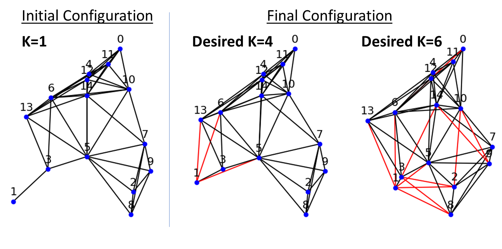
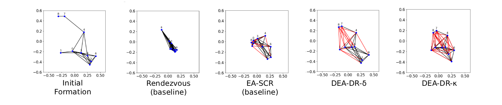
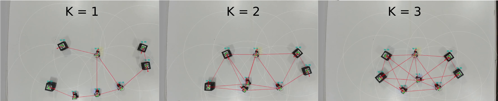

# Distributed Connectivity Restoration and Improvement in Networked Robots

Distributed, deterministic control for restoring and improving **k-connectivity**
in multi-robot networks — the implementation accompanying our IROS 2026 paper.

**Atharva Sagale · Tohid Kargar Tasooji · Ramviyas Parasuraman**
[HeRoLab](https://herolab.org/), University of Georgia
*Proc. IEEE/RSJ International Conference on Intelligent Robots and Systems (IROS), 2026*

<!-- TODO: replace the # links below with the real URLs -->
[📄 Paper](#) · [🔗 Project page](https://herolab.org/research/)

---

## Abstract

Multi-robot coordination requires maintaining network connectivity, especially in
critical operations such as search and rescue, where network robustness is
paramount. In this paper, we study the **Fast k-connectivity Restoration problem
(FCR)**, which aims to minimize the maximum distance required to restore
connectivity. Recent works have proposed scalable solutions, but they rely on a
centralized architecture or a learning-based solution to transfer the observable
policies from centralized to distributed variants. However, computing node
connectivity in a distributed setting is challenging, and performing such
operations in a deterministic, algorithmic manner is critical for generalizability
and persistent deployment in diverse, unknown environments. We propose a
distributed control approach for improving and restoring connectivity. Using local
neighborhood interactions and information, our algorithm improves the degrees of
individual robots by augmenting 1-hop edges based on their distances, achieving the
desired level of node connectivity and yielding comparable performance to achieve
sparse connectivity improvements and **up to 58% reduction in movements** required
to achieve dense connectivity over the state-of-the-art algorithms.

---

## The FCR problem



> **Figure 1.** Depiction of the FCR problem showing the initial configuration and
> the final configuration after augmented edges (links) to restore k-connectivity
> to K = 4 or 6.




> **Figure 2.** Working of the proposed approaches and baselines. The figures
> illustrate the final positions of the robots after edge augmentation and
> displacement. The edges in red represent the augmented edges.


## Real-world experiments



> **Figure 3.** Real-world experiment showcasing DEA-DR-k on our in-house swarm
> robotics testbed with a team of N = 8 robots, sensing radius = 0.5 m.


### Experimental Demonstration and Video
<video src="figures/FCR_demo.mp4" controls width="100%"></video>


## Repository

| File | Description |
| --- | --- |
| `DEA-DR-k.py` | k variant (DEA-DR-k): augments and **verifies** node connectivity κ ≥ K; also exposes the single-pass `DEADR`. |
| `DEA-DR-d.py` | δ variant: single-pass degree augmentation (no connectivity check). |
| `figures/` | Paper figures. |

### Installation

Requires Python 3 and the following packages:

```bash
pip install numpy matplotlib networkx pandas
```

### Usage

```python
# k variant (DEA-DR-k): iterates until node connectivity reaches K
from DEA_DR_k import DEA_DR_k
out = DEA_DR_k(seed=35, N=10, delta=0.5, K=4, plots=True)

# delta variant: single-pass degree augmentation
from DEA_DR_d import DEA_DR_d
out = DEA_DR_d(seed=35, N=10, delta=0.5, K=6, plots=True)
```

**Parameters**

| Parameter | Type | Description |
| --- | --- | --- |
| `seed` | `int` | RNG seed for the random deployment |
| `N` | `int` | Number of robots |
| `delta` | `float` | Sensing radius δ |
| `K` | `int` | Target degree / connectivity |
| `plots` | `bool` | Show the figures |
| `locations` | `ndarray` | Optional `2 × N` array overriding the random deployment |


**Returns**
The augmented positions, max / total robot displacement, the initial vs. final node connectivity, edge connectivity, and minimum degree, plus the number of edges added and relocation steps (see each  function's docstring for the exact tuple order).


Running either file directly (`python DEA-DR-k.py`) shows the plots and holds the
windows open until a key press; when the functions are called from a notebook/REPL
cell, figures render inline and there is no wait.

---

<!-- ## Citation

```bibtex
@inproceedings{sagale2026fcr,
  title     = {Distributed Connectivity Restoration and Improvement in Networked Robots},
  author    = {Sagale, Atharva and Kargar Tasooji, Tohid and Parasuraman, Ramviyas},
  booktitle = {Proceedings of the IEEE/RSJ International Conference on Intelligent Robots and Systems (IROS)},
  year      = {2026}
}
```

--- -->

## Contributions

- **Atharva Sagale** - Graduate Student
- **Dr. Ramviyas Parasuraman** - Lab Director

### [Heterogeneous Robotics Lab](https://hero.uga.edu/)
School of Computing, University of Georgia.


For further information, please contact Dr. Ramviyas Parasuraman at [ramviyas@uga.edu](mailto:ramviyas@uga.edu). 


<!-- The code in this repository was reorganized and commented with AI assistance
(Claude) for readability and efficiency. The algorithms, parameters, and
random-number sequence are unchanged; the method and research are the authors'. -->